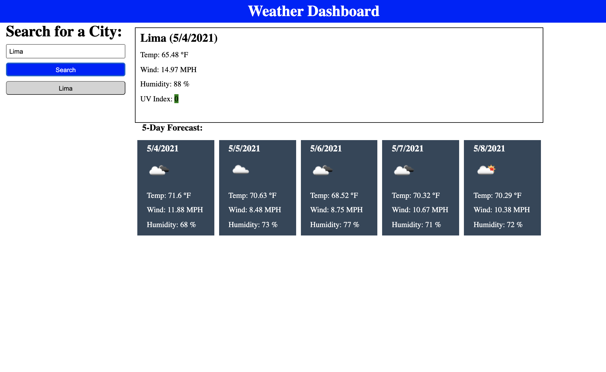

# Weather-Dashboard

## Javascript application using the Open Weather Map API

https://openweathermap.org/api

## Decription

This applications allows the user to enter a city name in the search field and get the weather information for such city, including
temperature, wind speed, humidity and UV index.

The UV index will appear color coded as green, yellow, and red to reflect the severity of the UV effect currently.

The application will also show a 5 day forecast, each day with the same information, for the city that was searched.

Finally, the application will generate a history of the cities searched in the form of a list of buttons for each city in case the user
wishes to compare the weather with multiple cities or go back to a previous searched city.

## Application Snapshots

## Link to the Application

https://forbegos.github.io/Weather-Dashboard/
